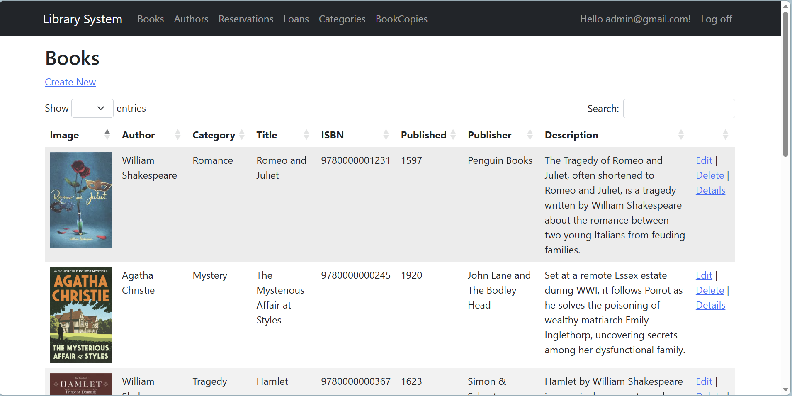
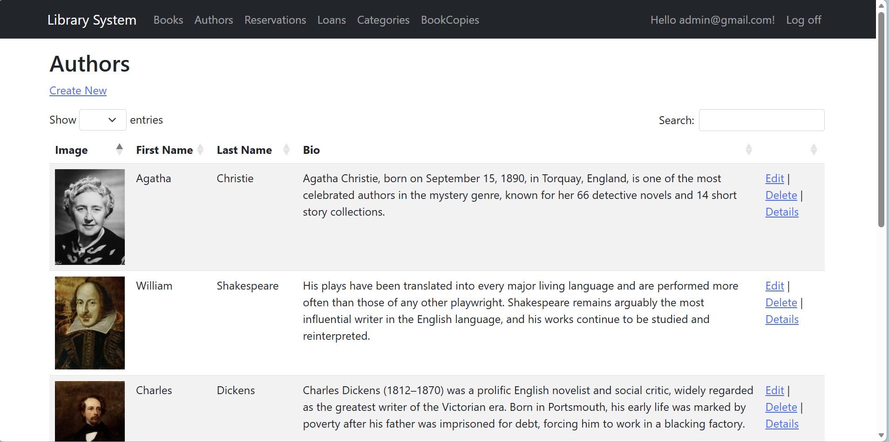
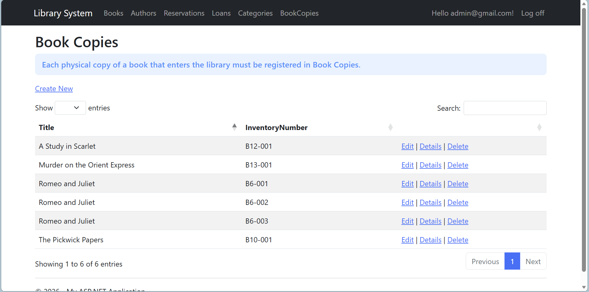
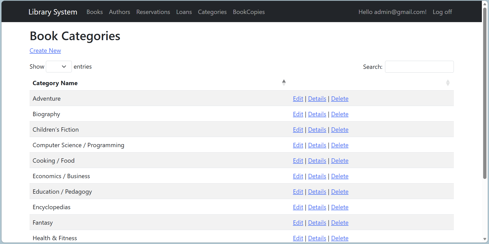
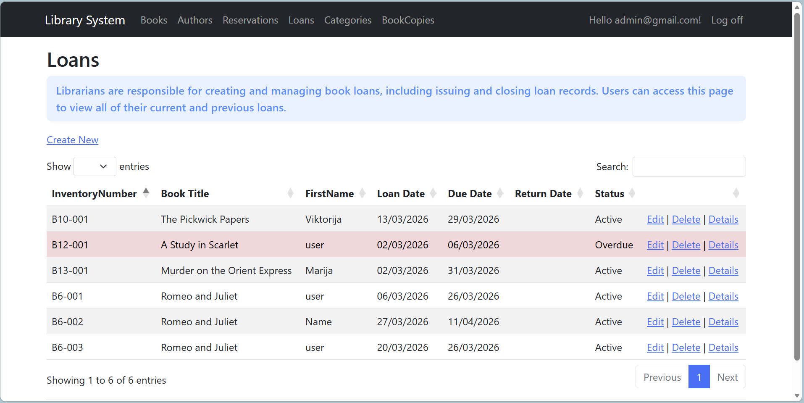
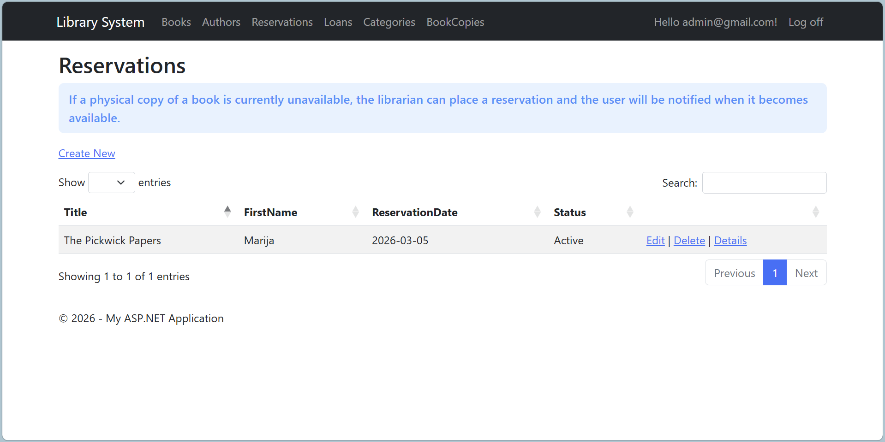

# Bookly – Enterprise Library Management System

**Bookly** is a production-ready ASP.NET MVC 5 web application modeling a real-world library with secure authentication, role-based authorization, business rule enforcement, and relational integrity using Entity Framework. It emphasizes clean architecture, domain modeling, and security-conscious implementation.

---

## 🎬 Live Demonstration

### Demo Video

---

## 📸 Application Screenshots

| Feature        | Screenshot |
|----------------|------------|
| Books          |  |
| Authors        |  |
| Book Copies    |  |
| Categories     |  |
| Loans          |  |
| Reservations   |  |

---

## 🗄 Database Architecture

### ER Diagram
The database is generated using Entity Framework Code-First and integrates ASP.NET Identity tables with domain entities.

**Key Relationships:**

- Book → Author (1:N)  
- Book → Category (1:N)  
- Book → BookCopy (1:N)  
- BookCopy → Loan (1:N)  
- User → Loan (1:N)  
- User → Reservation (1:N)  

This structure enforces referential integrity and models real-world inventory constraints.

---

## 1. System Architecture

**Pattern:** ASP.NET MVC  

- **Models** – Domain entities with validation & integrity constraints  
- **Controllers** – Handles business workflows  
- **Views** – Razor-based UI rendering  

---

## 2. Authentication & Authorization

### Authentication
- ASP.NET Identity  
- Cookie-based authentication  
- Claims-based identity generation  
- Secure session handling with Identity middleware  

### Role-Based Authorization (RBAC)
**Roles:** Admin, Librarian, User  

**Access Control Model:**

- **Admin:** Full system privileges  
- **Librarian:** Manage books, loans & reservations  
- **User:** Read-only access to personal records  

---

## 3. Security Implementation

### Input Validation
- Required, StringLength, Range, RegularExpression, DataType  
- Enforced before persistence  

### XSS Mitigation
- HTML tag blocking via regex  
- Razor automatic output encoding  

### CSRF Protection
- `[ValidateAntiForgeryToken]` on all state-changing POST endpoints  

### Overposting Protection
- `[Bind(Include = "...")]` on sensitive operations  

### Business Rule Enforcement
- Prevent double-loaning of the same BookCopy  
- Enforce role permissions before state mutation  
- Restrict record visibility based on identity  

---

## 4. Client-Side Enhancements
- jQuery & JavaScript-enhanced tables  
- Bootstrap UI components  
- Features: sorting, filtering, pagination, responsive layout  

---

## 5. Deployment & Exencution

**Requirements:**
- Visual Studio  
- SQL Server LocalDB  
- .NET Framework (MVC 5 compatible)  

**Steps:**
1. Clone repository  
2. Restore NuGet packages  
3. Run `Update-Database` (if migrations enabled)  
4. Run application  

**Default connection string:** `DefaultConnection`

---

## 6. Currently Working On

- **Email notification service** – sending automatic emails to users for loan creation, due dates, and overdue notifications.  
- **Audit logging** – tracking user actions like creating, editing, or deleting loans and books for accountability.  
- **Migration to ASP.NET Core** – upgrading the project to the modern ASP.NET Core framework for better performance, cross-platform support, and maintainability.  
- **AI-based Book Recommendation System** – suggesting books to users based on their past loans using an AI model, so each user sees personalized book suggestions.

## 7. Containerization and CI/CD

The application has been containerized and integrated into an automated CI/CD pipeline.

**Docker**
- Since Bookly runs on .NET Framework 4.7.2, the app is published locally via Visual Studio and executed inside a Linux container using the Mono runtime and mono-xsp4 web server, avoiding a full migration to .NET Core.
- A separate SQL Server 2019 Linux container replaces LocalDB, since LocalDB is Windows-only.
- `docker-compose.yml` orchestrates both the `web` and `db` services on a shared network.

**CI/CD — GitHub Actions**
- On every push to `main`, a workflow automatically builds the Docker image and pushes it to DockerHub (`bojananaumovska/bookly-mono:latest`), split into two jobs:
  - `build` - builds the image and saves it as an artifact
  - `push` - loads the artifact, authenticates with DockerHub, and pushes the image
- Image available at: [hub.docker.com/r/bojananaumovska/bookly-mono](https://hub.docker.com/r/bojananaumovska/bookly-mono/tags)
